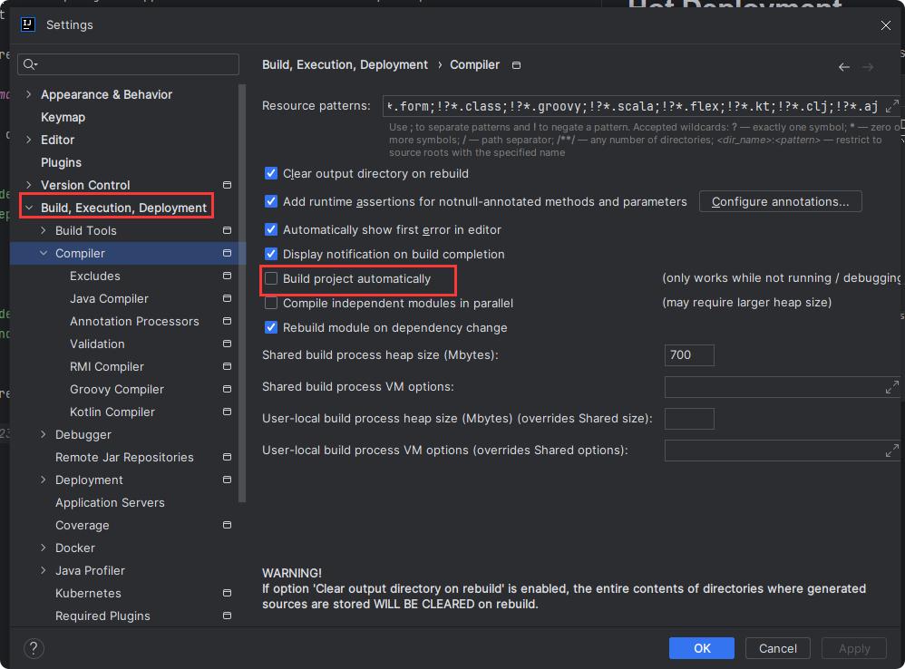
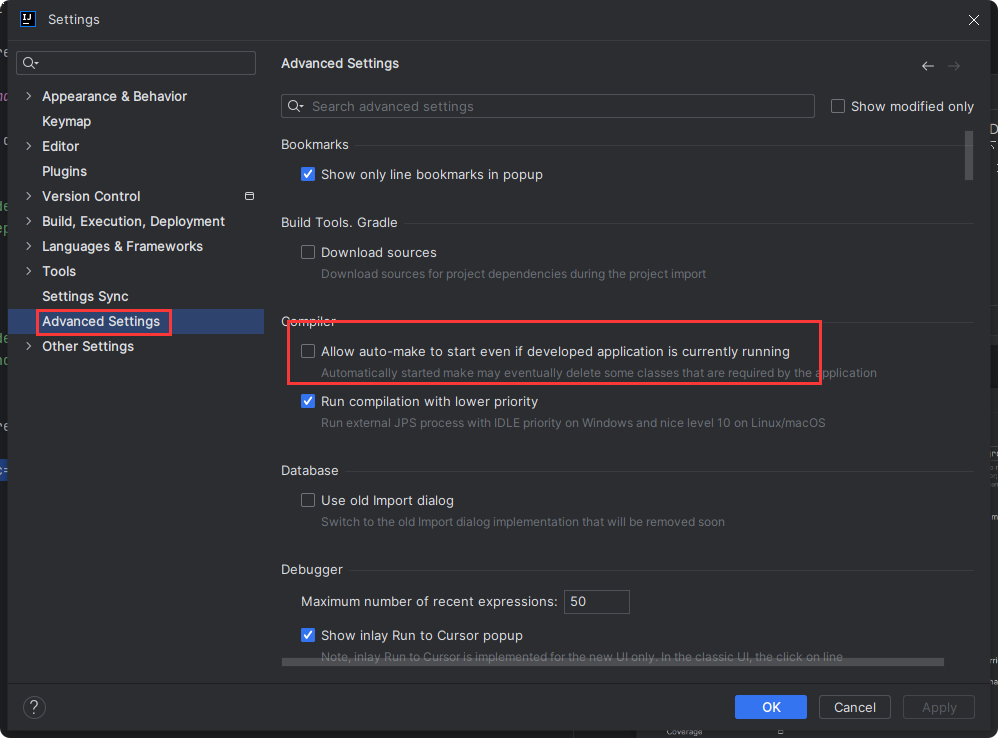

# Hot Deployment

- [Hot Deployment](#hot-deployment)
    * [1. Automated hot deployment](#1-automated-hot-deployment)
    * [2. Range of hot deployment](#2-range-of-hot-deployment)

Hot Deployment of SpringBoot applications refers to the ability to update modified code in real time and
take effect immediately without restarting server.

This can greatly improve efficiency during development.

## 1. Automated hot deployment

1. Add hot deployment dependency in the xml file.
    ```
    
    <dependencies>
        <dependency>
            <groupId>org.springframework.boot</groupId>
            <artifactId>spring-boot-devtools</artifactId>
            <scope>runtime</scope>
            <optional>true</optional>
        </dependency>
    </dependencies>
    ```

2. Configure the setting in the IDEA.

   

   

Now, the hot deployment has been reached, and you can see the effect of the modification in real time.


> **Q&A: How long does the hot deployment refresh project.?**
>
>    It is not a case that whenever we make a change to code, it will be synchronised to the browser in real time.
>
>    The refresh of a hot deployment depends on your mouse focus leaving the IDEA for 5 seconds,
> at which point it will automatically refresh the server.

## 2. Range of hot deployment

The list of directories that do not **trigger**(触发) a restart by default, the following directories will not
participate
in the hot deployment if the code inside them changes.

Hot deployment does not work for these directories:

- /META-INF/maven
- /META-INF/resources
- /resources
- /static
- /public
- /templates

Add the following to exclude the directories:

```yaml

spring:
  devtools:
    restart:
      exclude: static/**,public/**,config/application.yml
      # Close Hot Deployment.
      enabled: false
```


