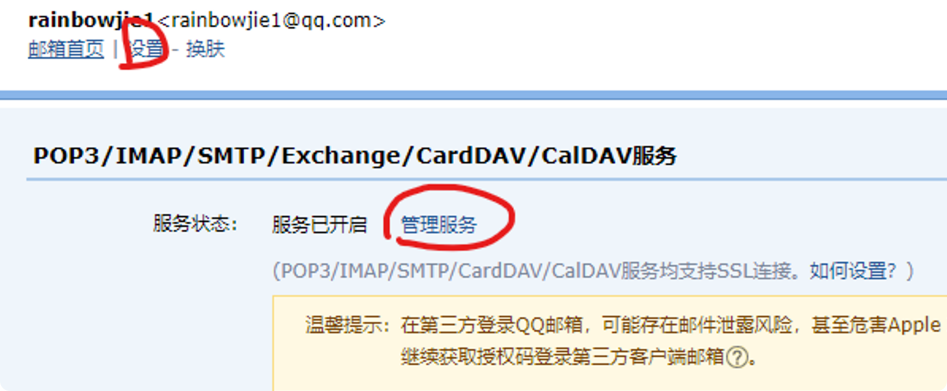
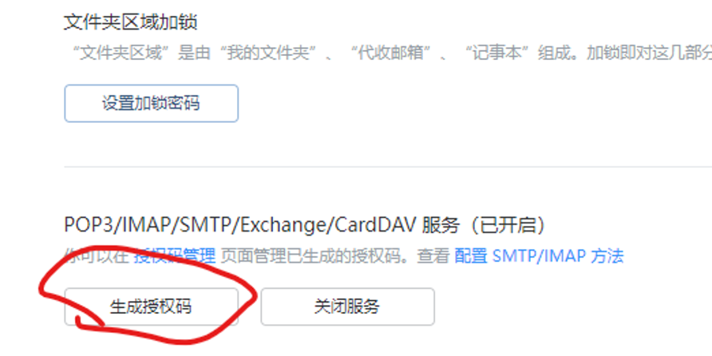

# Email

## 1.Get the QQ Email Authorization Code

1. **Setting**.

   

2. **Generate Authorization Code**.

   

## 2.Quick Start

1. Configure the email account information in the application.yaml.

    ```yaml
    #发送邮箱
      mail:
        #smtp服务主机  qq邮箱则为smtp.qq.com;163邮箱是smtp.163.com
        host: smtp.qq.com
        #服务协议
        protocol: smtp
        # 编码集
        default-encoding: UTF-8
        #发送邮件的账户
        username: 3021809270@qq.com
        #授权码
        password: yexecogmzfgidfia
        test-connection: true
        properties:
          mail:
            smtp:
              auth: true
              starttls:
                enable: true
                required: true
    ```

2. **CAPTCHA generator util**.

    ```java
    public class SecurityCodeGenerateUtil {
        //验证码包含的字段，可自己设置
        private static final String SYMBOLS = "0123456789ABCDEFGHIGKLMNOPQRSTUVWXYZ";
        private static final Random RANDOM = new SecureRandom();
    
        /**
         * 生成 6 位数的随机数字
         */
        public static String generateVerCode() {
            //	如果是六位，就生成大小为 6 的数组
            char[] numbers = new char[6];
            for (int i = 0; i < numbers.length; i++) {
                numbers[i] = SYMBOLS.charAt(RANDOM.nextInt(SYMBOLS.length()));
            }
            return new String(numbers);
        }
    }
    ```

3. **Send email API**.

    ```java
    /**
         * 发送验证码
         * 1、解析请求参数
         * 2、设置发送方
         * 3、设置接收方
         * 5、通过工具类获取验证码
         * 4、设置邮件信息
         * @param jsonObject
         * @return
         */
    //从yaml文件中获取发送邮箱的地址
    @Value("${spring.mail.username}")  
        private String fromEmail;
    
    @PostMapping("/securityCode")
        @ApiOperation("发送邮箱接口")
        public ResponseResult sendSecurityCode(@RequestBody JSONObject jsonObject) {
            Map<String, Object> map = new HashMap<>();
            System.out.println("******发送邮箱******\n\n");
            //解析参数
            String toEmail = (String) jsonObject.get("email");  //获取接收方邮箱地址
            //创建邮箱信息
            SimpleMailMessage message = new SimpleMailMessage();
            message.setFrom(fromEmail);  //设置发送方
            message.setTo(toEmail);  //设置接收方
            //设置邮箱信息
            message.setSubject("您本次的验证码是");  //设置邮箱主题
            String securityCode = SecurityCodeGenerateUtil.generateVerCode();  //获取验证码
            //设置邮件内容
            message.setText("尊敬的"+toEmail+",您好:\n"
                    + "\n本次请求的邮件验证码为:" + securityCode + "\n,本验证码 5 分钟内效，请及时输入。（请勿泄露此验证码）\n"
                    + "\n如非本人操作，请忽略该邮件。\n(这是一封通过自动发送的邮件，请不要直接回复）");
    
            try {
                mailSender.send(message);   //发送邮箱
                map.put("securityCode",securityCode);
                return ResponseResult.ok("验证码发送成功",map);  //返回验证码到前端
            } catch (Exception e) {
                logger.error("Controller层->sendSecurityCode方法：发送邮件失败");
                logger.error(e.getMessage());
                return ResponseResult.error("出现了一些错误，请联系管理员");
            }
        }
    ```