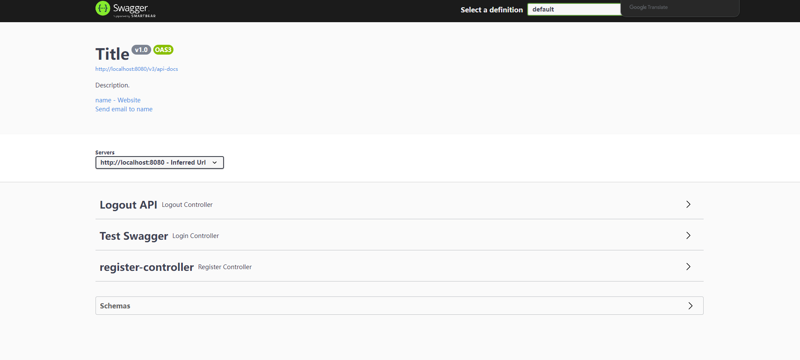

# Swagger

## 1.🥚Introduce

Swagger can generate a display page of an interface through simple configuration, which shows the request parameters,
returned result of the interface in a visual form, and provide convenient testing services.

1. **Front-end** developer can view the request parameters and returned data format through the interface page, and
   there is
   no need for back-end developer to write interface documents again;
2. **Back-end** developer can test and verify the interface through the interface display page, reducing the debugging
   cost in the development phase.

## 2.🍳Quick Start

### 2.1 Dependency

```xml

<dependencies>
    <dependency>
        <groupId>io.springfox</groupId>
        <artifactId>springfox-boot-starter</artifactId>
        <version>3.0.0</version>
    </dependency>
</dependencies>
```

### 2.2 Configuration in the application.yaml.

```yaml
spring:
  # After Springboot 2.6 version, you need to configure ant_path_matcher to make swagger work properly(适当地).
  mvc:
  path match:
    matching-strategy: ant_path_matcher
```

### 2.3 Register Configuration Class into Bean

```java

@Configuration
@EnableOpenApi
public class SwaggerConfig {
    @Bean
    public Docket docket() {
        Docket docket = new Docket(DocumentationType.OAS_30)
                .apiInfo(apiInfo()).enable(true)
                .select()
                //apis： Range of swagger scanning.
                .apis(RequestHandlerSelectors.basePackage("com.xxx.controller"))  // *** ************* Don't use '/'
                .paths(PathSelectors.any())
                .build();

        return docket;
    }

    private ApiInfo apiInfo() {
        return new ApiInfoBuilder()
                .title("Title")
                .description("Description.")
                .contact(new Contact("name", "url", "email"))
                .version("v1.0")
                .build();
    }
}

```

### 2.4 Using Simply

```java

@Api(tags = "Test Swagger")
@RestController
@RequestMapping("/swagger")
public class SwaggerController {

    @ApiOperation("Test Controller")
    @RequestMapping("/test")
    public String test() {
        return "xxxxxxx";
    }
}

```

1. **@Api**

    - `tags`：This is a String array that is used to classify or group API resources.
    - `value`：If you don't set tags, then value will be used as tag for API resources.
2. **@ApiOperation**

    - `value`：This is a brief description of the API method.
    - `notes`: A more detailed description.
    - `httpMethod`: Specify the HTTP method used by the API method, such as GET, POST, PUT, DELETE, etc.
    - `response`或`responses`: Describes the status codes that may be returned by API methods and what they
      mean, such as 200, 400, 401 and their description.

### 2.4 Swagger UI Page

**Before** 3.0 version, the url is: http://localhost:8080

**After** is: http://localhost:8080/swagger-ui/index.html



---

## 3. 🥞More

### 3.1 Customize API Parameters


```java

@ApiOperation(value = "User Logins in.", httpMethod = "POST")
@ApiImplicitParams({
        @ApiImplicitParam(name = "userName", value = "username"),
        @ApiImplicitParam(name = "password", value = "password")
})
@PostMapping("login")
public ResponseResult login(@RequestBody UserDto userDto) {
    //....
}
```

### 3.2

***

## 4. 🍟Problem

1. Can not access http://localhost:8080/swagger-ui.html.

   

### Solution

Check you Filter of security or interceptors, which may cause the problem.

1. Security Filter

   ```java
   @Override
       protected void configure(HttpSecurity http) throws Exception {
           http
                   .antMatchers(
                           "/swagger-ui/**",
                           "/swagger-resources/**",
                           "/v3/**",
                           "/profile/**"
                   ).permitAll()
                   .anyRequest().authenticated();
       }
   ```

or Interceptor.

## Reference

1. https://swagger.io/
2. https://www.cnblogs.com/antLaddie/p/17418078.html#_label0_2
