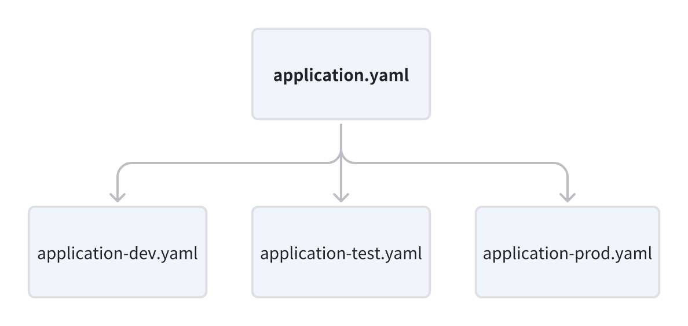

# Multiple Environment

- [Multiple Environment](#multiple-environment)
    * [1. 🥚Introduction](#1---introduction)
    * [2. 🍳Quick Start](#2---quick-start)
        + [2.1 Create multiple file](#21-create-multiple-file)
        + [2.2 Add profiles](#22-add-profiles)

## 1. 🥚Introduction

In the actual development process, an application usually has multiple environments, such as development, test and
production, etc.

Each environment may hava different configurations, such as database connections, server URL, etc.

So, here I will `take a closer look at`(仔细看看) how to use SpringBoot to configure multiple developments.

## 2. 🍳Quick Start

### 2.1 Create multiple file



SpringBoot allows to create different configuration files for different environments.

For example, we can create a `application-dev.yaml` file for development environment,

```yaml
server:
  port: 8080
  datasource:
    url: jdbc:mysql://localhost/dev
    username: root
    password: 5678
```

and a `application-test.yaml` file for test environment.

```yaml
server:
  port: 9090
  datasource:
    url: jdbc:mysql://localhost/prod
    username: root
    password: 5678
```

### 2.2 Add profiles

Reference different profiles in the `application.yaml`

```yaml
spring:
  profiles:
    active: dev  
```