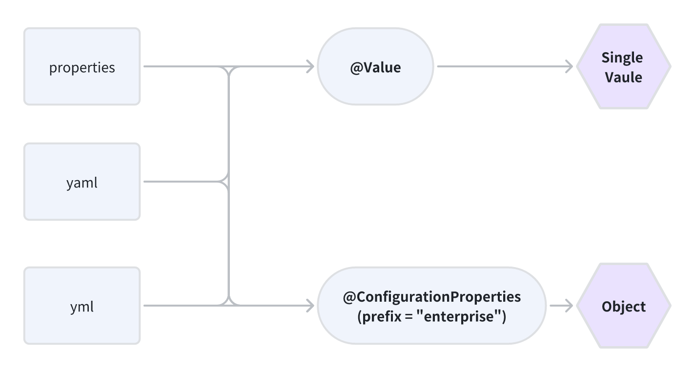

# Application File

## 1. Categories

The configuration file has three categories.

### 1.1 application.properties

```properties
enterprise.name=rainbow
enterprise.age=16
enterprise.phone=1234567890
```

### 1.2 application.yaml

```yaml
country: China
birthday: 1949-10-01

# Object
enterprise:
  name: rainbow
  age: 16
  phone: 1234567890
```

### 1.3 application.yml

```yml
country: China
birthday: 1949-10-01

# Object
enterprise:
  name: rainbow
  age: 16
  phone: 1234567890
```

Those profiles have a different priorities, like this: `properties > yml > yaml`.

## 2. Get values from YAML file.



### 2.1 Get single values.

If you just want ot get single value, you can use `@Value` annotation.

```yaml
enterprise:
  name: rainbow
  age: 16
  phone: 1234567890
```

```java
public class Person {
    @Value("enterprise.name")              // Get the value from YAML file.
    private String name;

    @Value("enterprise.age")
    private int age;

    @Value("enterprise.phone")
    private String phone;

    // ...
}
```

### 2.2 Get multiple values.

You also can use `@ConfigurationProperties` annotation to convert multiple values to an object.

```java

@Data
@ConfigurationProperties(prefix = "enterprise")
public class Person {
    private String name;
    private int age;
    private String phone;

    // ...
}
```


