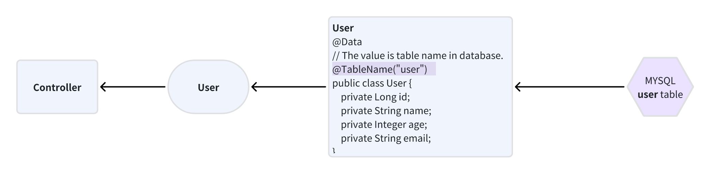

# Mybatis-Plus

- [Mybatis-Plus](#mybatis-plus)
    * [1. Quick Start](#1-quick-start)
        + [1.1 Maven](#11-maven)
        + [1.2 Configuration Database](#12-configuration-database)
        + [1.3 Create a Object](#13-create-a-object)
        + [1.4 Implement Mapper](#14-implement-mapper)
        + [1.5 Query Data](#15-query-data)
    * [2. Conditional Query](#2-conditional-query)
    * [3. Automatic primary key generation](#3-automatic-primary-key-generation)
        + [3.1 AUTO](#31-auto)
        + [3.2 NONE](#32-none)
        + [3.3 INPUT](#33-input)
        + [3.4 ASSIGN_ID](#34-assign-id)
        + [3.4 ASSIGN_UUID](#34-assign-uuid)
    * [Reference](#reference)

## 1. Quick Start


### 1.1 Maven

```xml

<dependencies>
    <dependency>
        <groupId>com.baomidou</groupId>
        <artifactId>mybatis-plus-boot-starter</artifactId>
        <version>3.4.3</version>
    </dependency>

    <dependency>
        <groupId>mysql</groupId>
        <artifactId>mysql-connector-java</artifactId>
    </dependency>
</dependencies>
```

### 1.2 Configuration Database

```yaml
spring:
  datasource:
    url: jdbc:mysql://localhost:3306/your_database_name
    username: your_database_username
    password: your_database_password
```

### 1.3 Create a Object

```java

@Data
@TableName("user")    // The value is table name in database.
public class User {
    private Long id;
    private String name;
    private Integer age;
    private String email;
}

```

### 1.4 Implement Mapper

```java
public interface UserMapper extends BaseMapper<User> {

}
```

### 1.5 Query Data

```java

@SpringBootTest
public class SampleTest {
    @Autowired
    private UserMapper userMapper;

    @Test
    public void testSelect() {

        List<User> userList = userMapper.selectList(null);

        userList.forEach(System.out::println);
    }

}

```

***

## 2. Conditional Query

Mybatis-Plus provides a simple way to implement complex condition queries,
mainly through the **QueryWrapper** or **LambdaQueryWrapper** class to dynamically construct conditions.

Here are some basic examples:

1. **QueryWrapper**

```java
import com.baomidou.mybatisplus.core.conditions.query.QueryWrapper;

@Service
public class UserServiceImpl extends ServiceImpl<UserMapper, User> implements UserService {
    @Override
    public List<User> selectByCondition(User user) {
        QueryWrapper<User> queryWrapper = new QueryWrapper<>();

        // equal
        queryWrapper.eq("username", user.getUsername());

        // like
        queryWrapper.like("email", "%" + user.getEmail() + "%");

        // greater than a certain value
        queryWrapper.gt("age", user.getAge());

        // In-scope enquiry
        queryWrapper.between("create_time", startTime, endTime);

        // Conditional combination (and)
        queryWrapper.and(i -> i.eq("status", 1).like("name", "张%"));

        // Conditional combinations (or)
        queryWrapper.or(i -> i.eq("gender", "男").eq("city", "北京"));

        return baseMapper.selectList(queryWrapper);
    }
}
```

2. **LambdaQueryWrapper**

```java
import com.baomidou.mybatisplus.core.conditions.query.LambdaQueryWrapper;

@Service
public class UserServiceImpl extends ServiceImpl<UserMapper, User> implements UserService {

    @Override
    public List<User> selectByCondition(User user) {
        LambdaQueryWrapper<User> lambdaQuery = new LambdaQueryWrapper<>();

        // Equivalent Queries (Lambda Expressions)
        lambdaQuery.eq(User::getUsername, user.getUsername());

        // Like 
        lambdaQuery.like(User::getEmail, "%" + user.getEmail() + "%");

        // 复杂查询条件
        lambdaQuery.gt(User::getAge, user.getAge())
                .between(User::getCreateTime, startTime, endTime)
                .and(wrapper -> wrapper.eq(User::getStatus, 1).like(User::getName, "张%"))
                .or(wrapper -> wrapper.eq(User::getGender, "男").eq(User::getCity, "北京"));

        return baseMapper.selectList(lambdaQuery);
    }
}
```

***

## 3. Automatic primary key generation

In Mybatis-Plus, there are a variety of **strategies**(策略) for automatic primary key generation.

```text
AUTO

NONE

INPUT

ASSIGN_ID

ASSIGN_UUID
```

the commonly used of which are the **auto-increment** and **UUID** methods.

### 3.1 AUTO

Auto-growth type for auto-increment primary key features.

```java
public class User {
    @TableId(value = "id", type = IdType.AUTO)
    private Long id;
    // ......
}
```

### 3.2 NONE

No special primary key generation strategy.

This means that the primary key needs to be set **manually**(手动).

```java
public class User {
    @TableId(value = "id", type = IdType.NONE)
    private Long id;
    // ......
}
```

### 3.3 INPUT

表示主键由外部输入，即在插入数据前，程序需要负责填充主键字段的值。
你需要定义

### 3.4 ASSIGN_ID

使用全局唯一ID生成器进行分配。默认情况下，如果没有指定具体的全局ID生成器，MP不会自动提供全局唯一ID。
但如果已经注册了全局ID生成器，则可以使用此选项让框架调用生成器来生成ID。

### 3.4 ASSIGN_UUID

在插入记录前，自动为主键字段分配一个UUID（Universally Unique Identifier）值。
这通常用于生成全球唯一的字符串类型的主键，但请注意，UUID并不是严格意义上的顺序递增ID，且可能对索引效率有一定影响。

```java
public class User {
    @TableId(value = "id", type = IdType.UUID)
    private String id;
    // .........
}
```

***

## Reference

1. [Quick Start](https://www.bilibili.com/video/BV1P24y1675x/?spm_id_from=333.999.0.0&vd_source=3040346f6e1d660a222fccde6b153716)
2. https://juejin.cn/post/7128788855532027941#heading-5
3. [Mybatis-plus](https://baomidou.com/pages/49cc81/#list)
4. https://juejin.cn/post/7321979919675359286?searchId=20240326161342B7159B408CD25003F1D6#heading-4