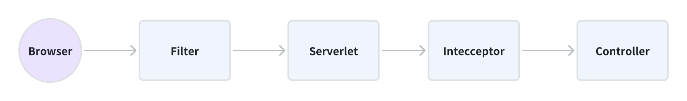
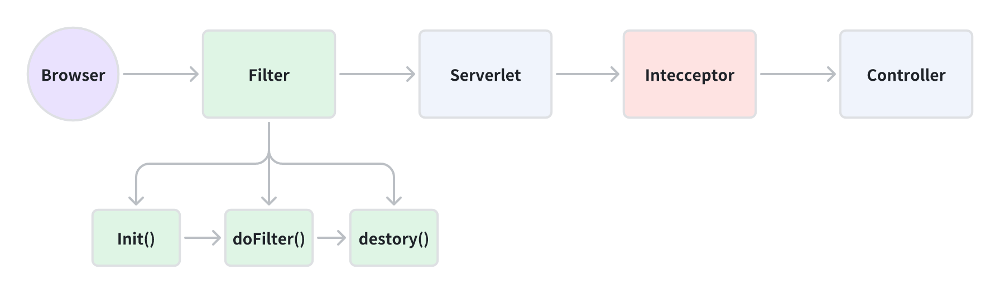
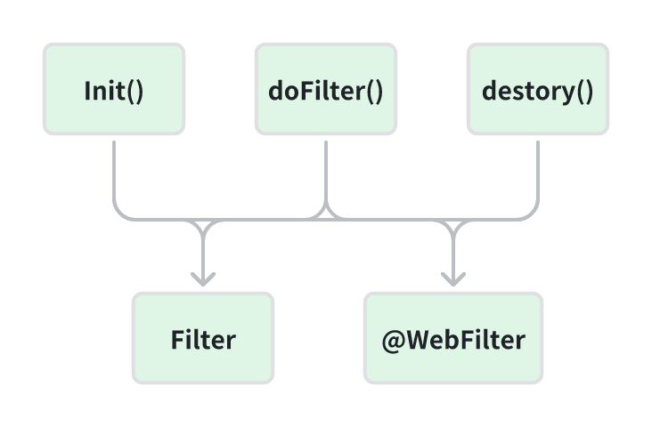
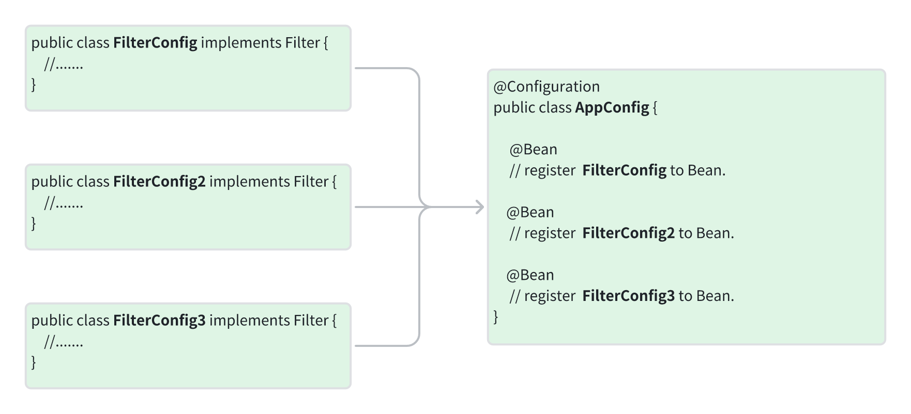

# Filter

- [Filter](#filter)
    * [1. Life Cycle](#1-life-cycle)
    * [2. Implement](#2-implement)
        + [Method1: java.servlet.Filter](#method1--javaservletfilter)
        + [Method2: @WebFilter(urlPatterns = "/*", filterName = "xxxFilter")](#method2---webfilter-urlpatterns---------filtername----xxxfilter--)
    * [3. Application Scenario(场景)](#3-application-scenario----)



Filter can interceptor and handle the HTTP request and responses.

Filter sit between the web server and the actual business logic, allowing developers to add additional processing logic
before or after the request is handled by a Servlet or Controller.

## 1. Life Cycle




Using filters is easy, we just implement the Filter class and override its 3 methods.

1. `init()`: When the Filter is loaded into the web application, the init() method will be called to perform the
   necessary
   initialization options.
2. `doFilter()`: The doFilter() method is called every time a request **matches**(调用) the filter.
3. `destory()`: The destory() method is called when the web application is closed or the Filter is removed from the
   container to clean up resources such as closing dastabase connections, canceling timed tasks, and so on.

## 2. Implement



### Method1: java.servlet.Filter

Implement `java.servlet.Filter` interface and register it with the SpringBoot container using `@Configuration`
and `@Bean`.



1. Configure Filter.

    ```java
    import javax.servlet.*;
    import java.io.IOException;
    
    public class FilterConfig implements Filter {
        @Override
        public void init(FilterConfig filterConfig) throws ServletException {
            // Initialize.
        }
    
        @Override
        public void doFilter(ServletRequest request, ServletResponse response, FilterChain chain)
                throws IOException, ServletException {
            System.out.println("Before request");
    
            // pass
            chain.doFilter(request, response);
    
            System.out.println("After request");
        }
    
        @Override
        public void destroy() {
            // Destroy
        }
    }
    ```

2. Sign up to Bean.

    ```java
    import org.springframework.boot.web.servlet.FilterRegistrationBean;
    import org.springframework.context.annotation.Bean;
    import org.springframework.context.annotation.Configuration;
    
    @Configuration
    public class AppConfig {
        @Bean
        public FilterRegistrationBean myFilterRegistration() {
            FilterRegistrationBean registration = new FilterRegistrationBean();
            registration.setFilter(new MyFilter());
            registration.addUrlPatterns("/api/*"); // Filter all request with /api.
            registration.setName("myFilter"); // Filter name.
            registration.setOrder(1);   // Filter execution order, the lower value the higher priority.
            return registration;
        }
    }
    ```

### Method2: @WebFilter(urlPatterns = "/*", filterName = "xxxFilter")

1. Implement `javax.servlet.Filter` interface.
   ```java
   
   @WebFilter(urlPatterns = "/api/*", filterName = "myFilter")
   @Order(1) // Execution Order.
   public class FilterConfig implements Filter{ 
        @Override
        public void init(FilterConfig filterConfig) throws ServletException {
            // Initialize.
        }
   
        @Override
        public void doFilter(ServletRequest request, ServletResponse response, FilterChain chain)
                  throws IOException, ServletException {
            System.out.println("Before request");
               // pass
            chain.doFilter(request, response);
            System.out.println("After request");
           }
        @Override
        public void destroy() {
            // Destroy
        }
       
   }
   ```

2. Add `@ServletComponentScan` in **SpringBootApplication**.

   ```java
   
   @SpringBootApplication
   @ServletComponentScan  // Filter
   public class SpringApplication {
       SpringApplication.run(Springboot02WebTestApplication .class,args);
   }
   ```

## 3. Application Scenario(场景)

1. **Authentication and Authorization**.
    - Check if the header of every request has token, if not, access is denied and a error message is returned.
2. **CORS**
3. **Logging**: Logging of all requests,including request parameters, response status, and processing time.
4. **Sensitive Information Filtering**: Remove sensitive information, such as password fields in SQL statements from
   requests or response.


