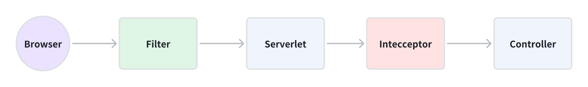
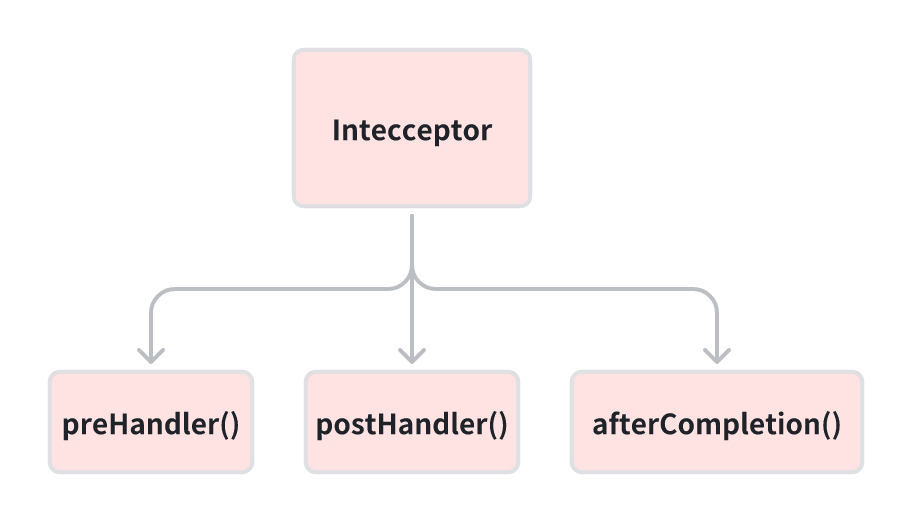
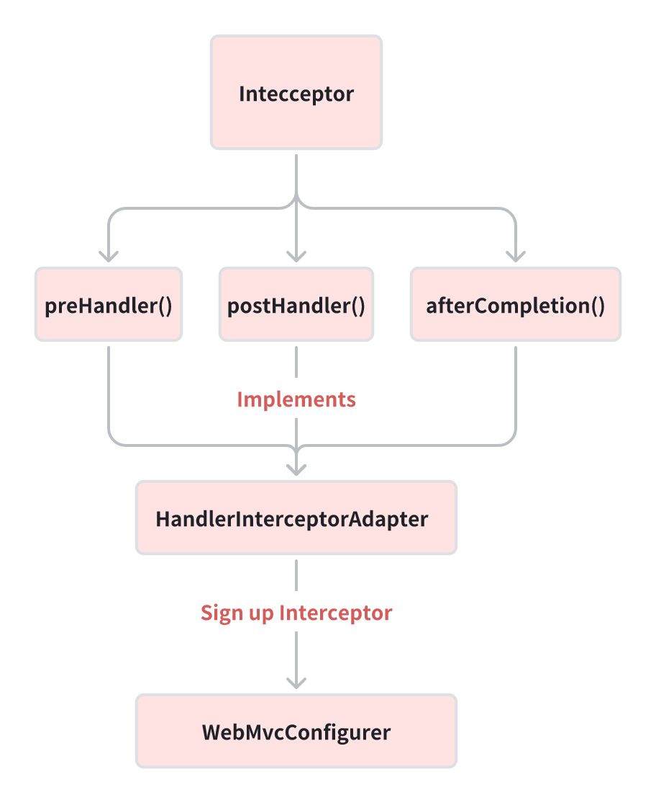

# Interceptor

- [Interceptor](#interceptor)
    * [1. Custom Interceptor](#1-custom-interceptor)
        + [1.1 Extends HandlerInterceptorAdapter OR Implements HandlerAdapter](#11-extends-handlerinterceptoradapter-or-implements-handleradapter)
        + [1.2 Sign Up Interceptor](#12-sign-up-interceptor)
    * [2. Application Scenario(場景)](#2-application-scenario----)



Interceptor and Filter, both of them are cutter-oriented programming(AOP).

You can use it to perform some tasks, such as writing logs, adding or updating configurations
before Controller processes a request.

## 1. Custom Interceptor

### 1.1 Extends HandlerInterceptorAdapter OR Implements HandlerAdapter



If you want to custom interceptor, you need to extend `HandlerInterceptorAdapter` and
override `preHandle`,`postHandle`,`afterCompletion` methods.

```java
public class TokenInterceptor extends HandlerInterceptorAdapter {

    @Override
    public boolean preHandle(HttpServletRequest request, HttpServletResponse response, Object handler) throws Exception {
        // Get token.
        String token = request.getHeader("token");

        // Check if token exists.
        if (!StringUtils.hasText(token)) {
            response.sendError(HttpServletResponse.SC_UNAUTHORIZED);
            return false;
        }

        // Parse token.
        String userId;
        try {
            Claims claims = JwtUtil.parseJWT(token);
            String userId = claims.getSubject();
        } catch (Exception e) {
            e.printStackTrace();
            return false;
        }
        return true;
    }


    @Override
    public void postHandle(HttpServletRequest request, HttpServletResponse response, Object handler, ModelAndView modelAndView) throws Exception {

    }

    @Override
    public void afterCompletion(HttpServletRequest request, HttpServletResponse response, Object handler, Exception ex) throws Exception {

    }
}
```

<details>
<summary>Source Code of HandlerInterceptorAdapter</summary>

```java
public abstract class HandlerInterceptorAdapter implements AsyncHandlerInterceptor {

    /**
     * This implementation always returns {@code true}.
     */
    @Override
    public boolean preHandle(HttpServletRequest request, HttpServletResponse response, Object handler)
            throws Exception {

        return true;
    }

    /**
     * This implementation is empty.
     */
    @Override
    public void postHandle(HttpServletRequest request, HttpServletResponse response, Object handler,
                           @Nullable ModelAndView modelAndView) throws Exception {
    }

    /**
     * This implementation is empty.
     */
    @Override
    public void afterCompletion(HttpServletRequest request, HttpServletResponse response, Object handler,
                                @Nullable Exception ex) throws Exception {
    }

    /**
     * This implementation is empty.
     */
    @Override
    public void afterConcurrentHandlingStarted(HttpServletRequest request, HttpServletResponse response,
                                               Object handler) throws Exception {
    }

}

```

</details>

### 1.2 Sign Up Interceptor



In the SpringBoot application, custom interceptors are usually registered by implementing `WebMvcConfigurer` interface
and registering them in the `addInterceptors` method.

```java

@Configuration
public class WebConfig implements WebMvcConfigurer {

    @Autowired
    private TokenInterceptor tokenInterceptor;

    @Override
    public void addInterceptors(InterceptorRegistry registry) {
        registry.addInterceptor(tokenInterceptor)
                .addPathPatterns("/**")       // Interceptor all paths.
                .excludePathPatterns("/login", "/logout", "/api/public/**")  // Exclude paths that do not require Token authentication.
                .order(1);    // Set the order, if you have some interceptors.
    }
}
```

## 2. Application Scenario(場景)

1. **Authentication and Authorization.**
2. **Unified(统一) Response Package**
    - Before all interfaces return, the interceptor will wrap the server response data in a unified format, such as
      adding a timestamp, error code, prompt information, etc.
3. **Performance Monitoring and Statistic**
    - Interceptors can be used to count the number of requests, average response time and other metrics, and help
      `optimise`(优化) system performance.

4. **Request current limiting and fusing.**
    - when the system is overstressed, the interceptor can limit the number of concurrent accesses to an interceptor, or
      `trigger`(触发) a `meltdown mechanism`(熔断机制) when a threshold is reached to avoid a system crash.
