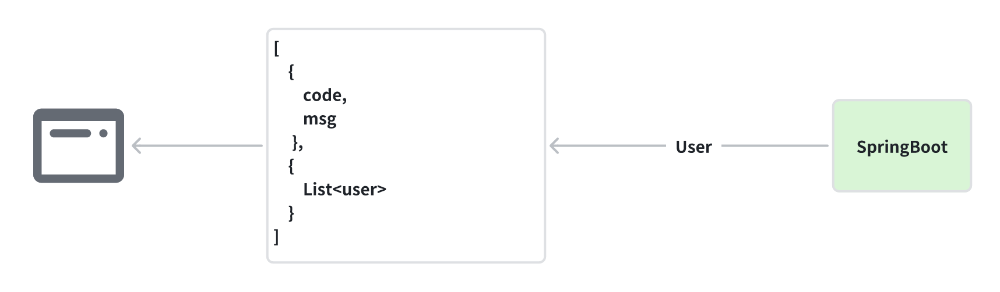

# Unified Response Format

- [Unified Response Format](#unified-response-format)
    * [Quick Start](#quick-start)

***
In the development of the API, we have decided to use a unified response format for all requests.

This will help to `standardize`(规范) the structure and format of responses, making it easier for developers to work
with the
API.

## Quick Start



1. **FastJson Dependency**

    ```xml
    <dependency>
        <groupId>com.alibaba</groupId>
        <artifactId>fastjson</artifactId>
        <version>1.2.79</version>
    </dependency>
    ```

2. **Response class.**

    ```java
    @Data
    // If properties are null, and it is not converted into Json object.
    @JsonInclude(JsonInclude.Include.NON_NULL)
    @AllArgsConstructor
    @NoArgsConstructor
    public class ResponseResult<T> {
        private Integer code;  
        private String msg;
        private T data;
    }
    ```
3. **Use it.**

    ```java
    @RestController
    @RequestMapping("user")
    public class demoController {
        @Autowired
        private StaffService staffService;
    
        @PostMapping("findAll")
        public ResponseResult findAllStaffs() {
            List<staff> users = staffService.findAll();   // Get all users and store them into list.
            
            ResponseResult<List> responseResult = new ResponseResult<>(200, "Response Successfully.", users);
            return responseResult;
        }
    }
    ```