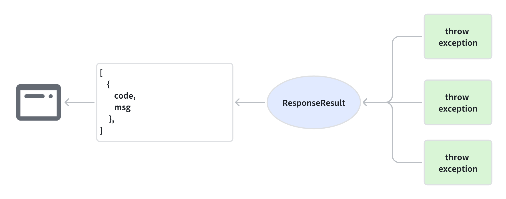
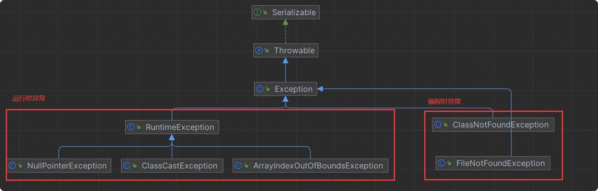

# Exception Handling

- [Exception Handling](#exception-handling)
    * [1.Quick Start](#1quick-start)
        + [1.1@ControllerAdvice](#11-controlleradvice)
    * [Reference](#reference)

***

## 1.Quick Start



### 1.1@ControllerAdvice

`@ControllerAdvice` is an annotation in Spring MVC that allows you to define exception handling and other cross-cutting
concerns globally across all controllers.

It doesn't directly implement any interface, but rather works through aspects and annotations provided by the Spring
Framework.

Here's a basic implements of the @ControllerAdvice to handle exception.

1. **ResponseResult entity**

    ```java
    
    @Data
    // If properties are null, and it is not converted into Json object.
    @JsonInclude(JsonInclude.Include.NON_NULL)
    @AllArgsConstructor
    @NoArgsConstructor
    public class ResponseResult<T> {
        private Integer code;
        private String msg;
        private T data;
    }
    ```

2. **ExceptionHandler class**

    ```java
    import org.springframework.http.HttpStatus;
    import org.springframework.http.ResponseEntity;
    import org.springframework.web.bind.annotation.ControllerAdvice;
    import org.springframework.web.bind.annotation.ExceptionHandler;
     
    @RestControllerAdvice    // convert response to json.
    public class GlobalExceptionHandler {
        // Alternatively, you can have a general exception handler
        @ExceptionHandler(value = Exception.class)
        public ResponseEntity<String> handleGenericException(Exception ex) {
            return new ResponseResult<>(HttpStatus.INTERNAL_SERVER_ERROR,"An unexpected error occurred.");
        }
    
        // Custom exception handling type. 
        @ExceptionHandler(value = RuntimeException.class)
        public ResponseEntity<String> handleRuntimeException(RuntimeException ex) {
            return new ResponseResult<>(HttpStatus.BAD_REQUEST,"Invalid argument supplied.");
        }
     
        // Add more exception handlers as needed...
     
         
    }
    ```
   Here's the types of exception in java, you can custom exception handling types.

   

## Reference

1. [异常统一处理](https://www.bilibili.com/video/BV1T54y1n7PB?p=63&spm_id_from=pageDriver&vd_source=3040346f6e1d660a222fccde6b153716)